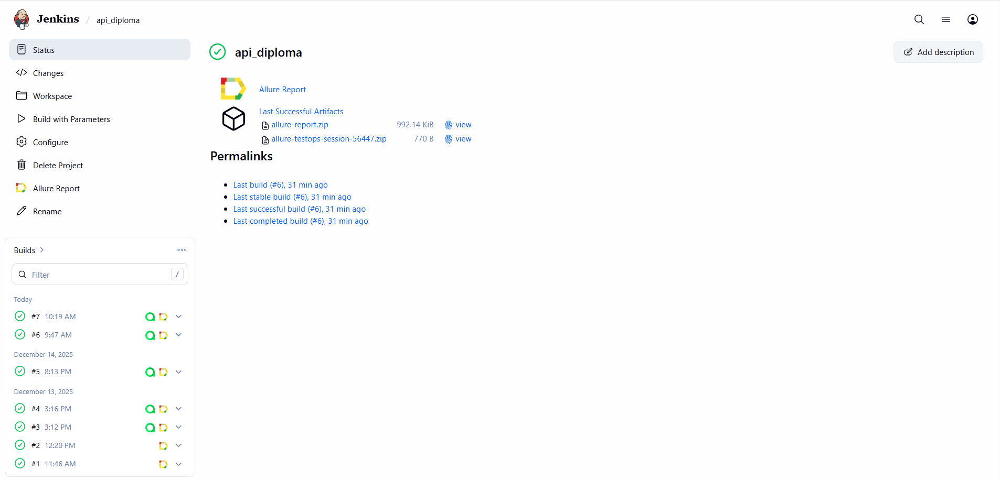
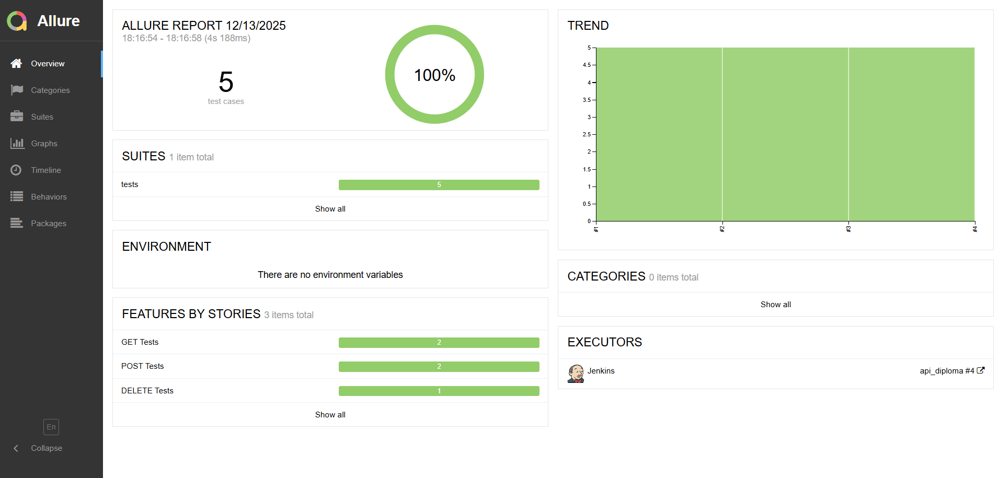
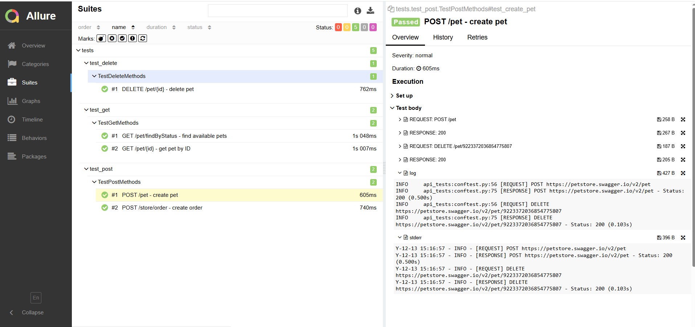
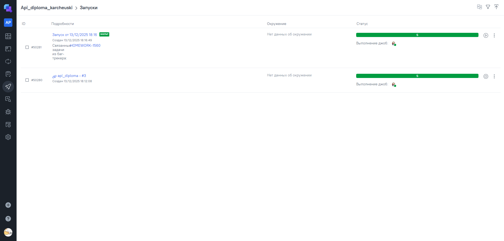
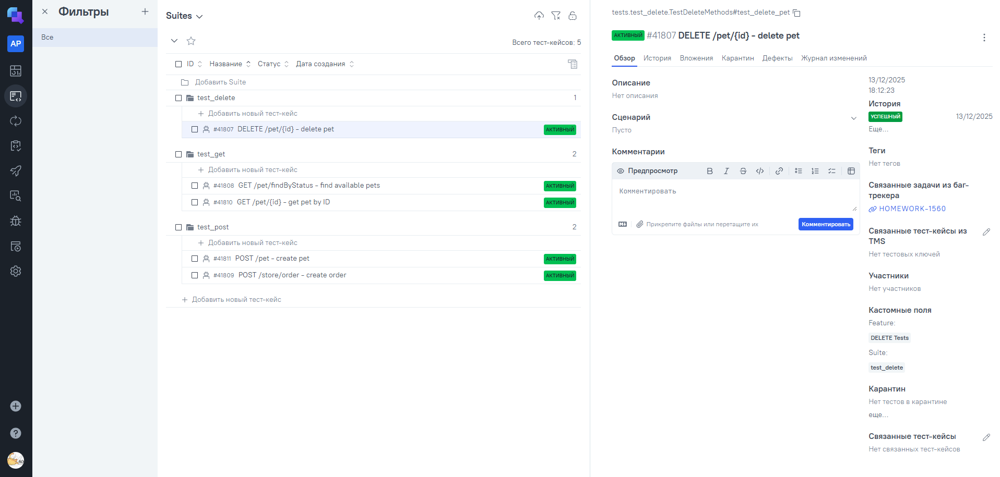
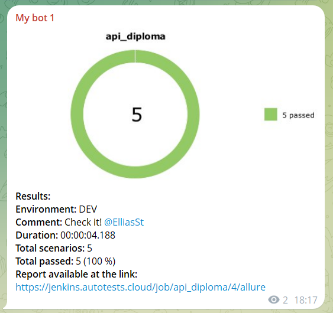

# Pet Store API Test Automation

> End-to-end automated API testing framework for the [Pet Store demo API](https://petstore.swagger.io)

## 📋 Project Overview 
Professional API testing framework showcasing modern automation practices:

- **Pydantic schemas** for robust request/response validation
- **Allure reporting** with detailed API call logging
- **Endpoint-based architecture** for clean test design
- **Console logging** with execution metrics and timing
- **Jenkins-ready** with standardized output formats

---

## 🛠 Tech Stack


---

## 🚀 Quick Start

### Installation

```bash
# 1. Clone repository
git clone https://github.com/Elias373/api_diploma
cd api_diploma

# 2. Create virtual environment
python -m venv venv

# 3. Activate virtual environment
# macOS / Linux:
source venv/bin/activate
# Windows:
venv\Scripts\activate

# 4. Install dependencies
pip install -r requirements.txt
```

### Run Tests
```bash
# Run all tests with Allure reporting
pytest --alluredir=allure-results

# Run specific test class
pytest tests/test_get.py -v

# View Allure report
allure serve allure-results
```

---

## ✅ Test Coverage

### Overall Statistics
| Metric | Value |
|--------|-------|
| **Total Tests** | 5 |
| **Pass Rate** | 100% |
| **HTTP Methods Covered** | GET, POST, DELETE |
| **Endpoints Tested** | 4 |

### Detailed Test Breakdown

#### **GET Method Tests** (2 tests)
| Test Case | Status | Endpoint | Assertions |
|-----------|--------|----------|------------|
| **Find Available Pets** | ✅ PASS | `GET /pet/findByStatus` | Status 200, list type, schema validation |
| **Get Pet by ID** | ✅ PASS | `GET /pet/{id}` | Status 200, ID match, name validation, schema |

#### **POST Method Tests** (2 tests)
| Test Case | Status | Endpoint | Assertions |
|-----------|--------|----------|------------|
| **Create New Pet** | ✅ PASS | `POST /pet` | Status 200, ID present, name match, schema |
| **Create Order** | ✅ PASS | `POST /store/order` | Status 200, order ID, petId match, schema |

#### **DELETE Method Test** (1 test)
| Test Case | Status | Endpoint | Assertions |
|-----------|--------|----------|------------|
| **Delete Pet** | ✅ PASS | `DELETE /pet/{id}` | Status 200, response structure, deletion verification |

---

### 📊 Report Examples

#### [Jenkins](https://jenkins.autotests.cloud/job/api_diploma/) Build



#### Allure Overview  


#### Test Details with logs


#### [TestOps](https://allure.autotests.cloud/project/5047/dashboards) Runs



#### TestOps Test Cases


#### [Jira](https://jira.autotests.cloud/browse/HOMEWORK-1560) Integration


#### Telegram Notification


## 👤 Author

**Illia Karcheuski**

[LinkedIn](https://pl.linkedin.com/in/ilyakorchevsky/ru)
